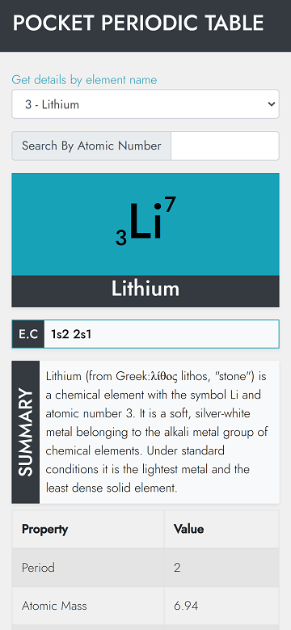

# Pokkt Periodic Table

A **mobile-friendly web application** to explore detailed information about periodic table elements in an interactive and visually appealing format.

---

## 🌟 **Features**

- **Element Details:** View comprehensive information for each element, including atomic number, symbol, and properties.
- **Responsive Design:** Optimized for both desktop and mobile devices for seamless user experience.
- **User-Friendly Interface:** Easy navigation and quick access to element data.
- **Deployed Application:** Accessible online at [pokktpt.netlify.app](https://pokktpt.netlify.app/).

---

## 🛠️ **Tech Stack**

- **Frontend:** React.js
- **Styling:** React-Bootstrap, CSS
- **Deployment:** Netlify

---

## 🚀 **Getting Started**

### Prerequisites:

- Node.js installed on your machine.
- A basic understanding of React.js.

### Steps to Run Locally:

1. Clone the repository:

   ```bash
   git clone https://github.com/reetpriye/pokkt-periodic-table.git
   cd pokkt-periodic-table
   ```

2. Install dependencies:

   ```bash
   npm install
   ```

3. Start the development server:

   ```bash
   npm start
   ```

4. Open your browser and navigate to:
   ```
   http://localhost:3000
   ```

---

## 📦 **Available Scripts**

### Development:

- **Run the app:**
  ```bash
  npm start
  ```
  Launches the app in development mode.

### Build:

- **Create a production build:**
  ```bash
  npm run build
  ```
  Generates a minified production-ready build in the `build` folder.

### Testing:

- **Run tests:**
  ```bash
  npm test
  ```
  Launches the test runner in interactive watch mode.

---

## 📁 **Project Structure**

```plaintext
pokkt-periodic-table/
├── assets/          # Static assets
├── public/          # Public files like index.html
├── src/             # React components and logic
├── .gitignore       # Git ignored files
├── package.json     # Project metadata and dependencies
├── README.md        # Documentation
```

---

## 🌐 **Deployment**

This application is deployed on **Netlify**. To deploy your own version:

1. Build the app:
   ```bash
   npm run build
   ```
2. Upload the contents of the `build/` directory to Netlify.
